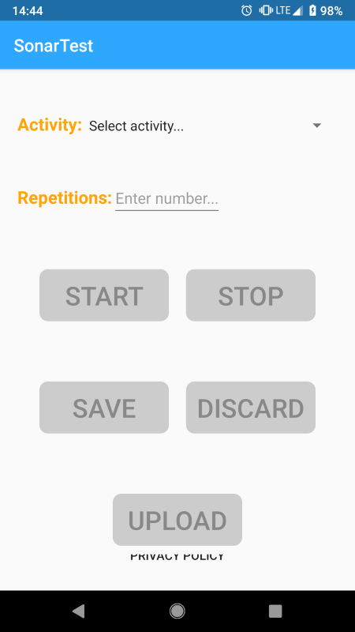

# AudioRecord
This Android app was built to facilitate data collection for a computer science research study on acoustic sensing of physical exercises through a smartphone. The only hardware the sensing algorithm uses is the smartphone's unmodified speaker and microphone. The goal is to use the data collected by this app to develop a signal processing algorithm to automatically identify and quantity the user's physical exercises.

This app implements Frequency Modulated Continuous Wave (FMCW) sensing by emitting an acoustic tone whose frequency periodically oscillates. While the phone plays the tone, it simultaneously records audio through the microphone, so that the received backscattered sound waves can later be processed and analyzed. 

The app provides a user interface that enables subjects of the in-the-wild study to authenticate themselves, to start and stop their data collection, and save their data on a server. This data is then processed and analyzed separately.

## User interface

